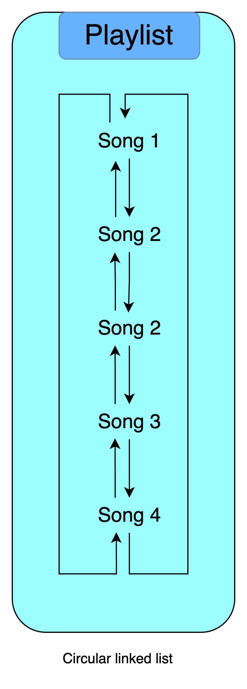

# Introduction

I am here to introduce you to the concepts of DSA.

My goal is to make the book as visual as possible giving real world examples wherever possible.

## Overview

Let's dive into some of the real world use cases where the data structures are used.

- During booking tickets (in train/bus/movie), we see a page showing the seats. That's a 2-D array with seats booked: E1 (`array[0][4]`), E2 (`array[1][4]`), E3 (`array[2][4]`), E4 (`array[3][4]`), E5 (`array[4][4]`), and so on.

> A to L are rows indexed in **array** from 0 to 11. Like in dataframe, column index 1st, then row's index. That's why `array[c][r]`.

- During browsing websites, when we go from one page to another like page-1 to page-2 to page-3. The links are stored in a stack as moved forward and removed when moved backward. So, the **stack** data changes depending on the browsing. From DSA context, the principle applied is LIFO.

- When standing in a line/queue like in shopping mall billing counter (as shown below), we see the data in a **queue**. The principle of **queue** is FIFO for insertion and removal.

- Next for a **singly linked list**, we can think of songs in a playlist. We can't go backwards in a linked list, but in one direction.

  Now, imagine the same list of songs are stored in a playlist i.e. of **doubly-linked list** collection type, then you can go back and forth as you wish.

  

Expand:

  

  

  We could also have the songs played in a **circular** way as well. This means additionally we can go from first to last song directly bypassing intermediary songs. And the playlist can be cyclic and hence songs can be repeated.

  

Expand:

  

  

- When viewing location on a map, we may get multiple routes to reach there. Alongwith, we also get the distance & time info to decide which route would take less time. This is done using Dijkstra's algorithm (most popular). The data structure used here is **Graph**

